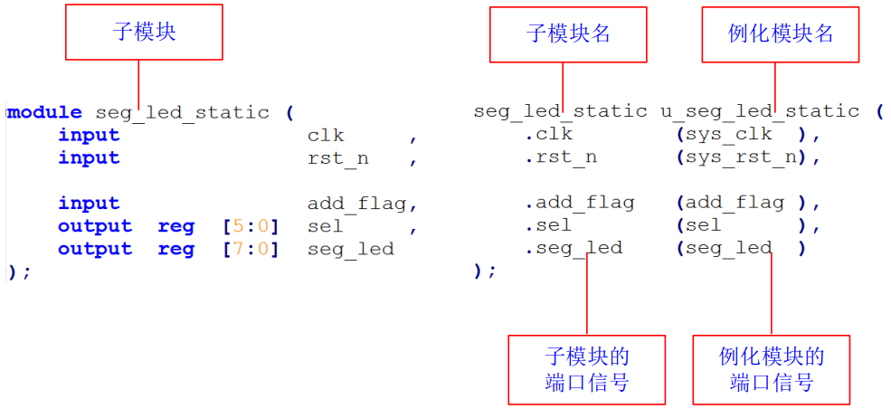
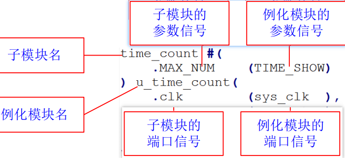

## 1 Verilog常用
### 1.1 阻塞赋值=与非阻塞赋值<=
```Verilog
//初始条件a=1,b=2,c=3
a=0;      a<=0;
b=a;      b<=a;
c=b;      c<=b;
//clk_en(n)第n个有效时刻
clk_en0   en0  en1  en2  
a=b=c=0   a=0  a=0  a=0
          b=1  b=0  b=0
          c=2  c=1  c=0
```
### 1.2 always与assign
* always 语句可以带时钟，也可以不带时钟
* 在 always 不带时钟时，逻辑功能和 assign 完全一致，都是只产生组合逻辑。比较简单的组合逻辑推荐使用 assign 语句，比较复杂的组合逻辑推荐使用 always 语句
```Verilog
assign counter_en = (counter == (COUNT_MAX - 1'b1)) ? 1'b1 : 1'b0; 
always @(*) begin
    case (led_ctrl_cnt) 
        2'd0 : led = 4'b0001;
        2'd1 : led = 4'b0010;
        2'd2 : led = 4'b0100;
        2'd3 : led = 4'b1000;
        default : led = 4'b0000;
    endcase
end
//带时钟信号时，这个逻辑语句才能产生真正的寄存器
always @(posedge sys_clk or negedge sys_rst_n) begin
    ...
end
```
### 1.3 锁存器latch
锁存器是一种对脉冲电平敏感的存储单元电路。锁存器和寄存器都是基本存储单元，锁存器(latch)是电平触发的存储器，寄存器(reg)是边沿触发的存储器。两者的基本功能是一样的，都可以存储数据。锁存器是组合逻辑产生的，而寄存器是在时序电路中使用，由时钟触发产生的。
注：**latch 的主要危害是会产生毛刺（glitch），这种毛刺对下一级电路是很危险的。并且其隐蔽性很强，不易查出。因此，在设计中，应尽量避免 latch 的使用。**<br>
解决方案：代码里面出现 latch 的两个原因是在组合逻辑中，if 或者 case 语句不完整的描述，比如 if 缺少 else 分支，case 缺少 default 分支，导致代码在综合过程中出现了 latch。**解决办法就是 if 必须带 else 分支，case必须带 default 分支。**
### 1.4 状态机
1. 一段式：**不推荐**，整个状态机写到一个 always 模块里面，在该模块中既描述状态转移，又描述状态的输入和输出
2. 二段式：一个 always 模块采用同步时序描述状态转移；另一个模块采用组合逻辑判断状态转移条件，描述状态转移规律以及输出。
3. 三段式：**用的最多**，
    * 第一个实现同步状态跳转；
    * 第二个采用组合逻辑判断状态转移条件；
    * 第三个描述状态输出（可以用组合电路输出，也可以时序电路输出），**有利于综合器分析优化以及程序的维护**
```Verilog
module divider7_fsm (
    //系统时钟与复位
    input sys_clk ,
    input sys_rst_n ,
    //输出时钟
    output reg clk_divide_7 
);
 //parameter define
parameter S0 = 7'b0000001; //独热码
parameter S1 = 7'b0000010;
...
parameter S6 = 7'b1000000;

//reg define 
reg [6:0] curr_st ; //当前状态
reg [6:0] next_st ; //下一个状态

//状态机的第一段采用同步时序描述状态转移
always @(posedge sys_clk or negedge sys_rst_n) begin
    if (!sys_rst_n)
        curr_st <= S0;
    else
        curr_st <= next_st;
    end
//状态机的第二段采用组合逻辑判断状态转移条件
always @(*) begin
    case (curr_st)
        S0: next_st = S1;S1: next_st = S2;S2: next_st = S3;S3: next_st = S4;
        S4: next_st = S5;S5: next_st = S6;S6: next_st = S0;
        default: next_st = S0;
    endcase
end
//状态机的第三段描述状态输出（这里采用时序电路输出）
always @(posedge sys_clk or negedge sys_rst_n) begin
    if (!sys_rst_n)
        clk_divide_7 <= 1'b0;
    else if ((curr_st == S0) | (curr_st == S1) | (curr_st == S2) | (curr_st == S3))
        clk_divide_7 <= 1'b0;
    else if ((curr_st == S4) | (curr_st == S5) | (curr_st == S6))
        clk_divide_7 <= 1'b1; 
    else
        ;
end
endmodule
```
### 1.5 模块的例化
自顶向下设计模式：一般顶层只做模块例化

参数的例化是在模块例化的基础上，增加了对参数的信号定义。<br>在模块名的后面加上“#”，表示后面跟着的是参数列表。


### 1.6 工程组织形式
一般为
```c
XX 工程名
|--doc 存放工程相关的文档,包括该项目用到的 datasheet、设计方案等
|--par 存放工程文件和使用到的一些 IP 文件
|--rtl 存放工程的 rtl 代码，这是工程的核心，文件名与 module 名称应当一致，建议按照模块的层次分开存放
|--sim 存放工程的仿真代码
```
### 1.7 代码组织形式
* 由于不同的解释器对于 TAB 翻译不一致，所以建议不使用 TAB，全部使用空格。
* 避免产生 Latch 锁存器，比如组合逻辑里面的 if 不带 else 分支、case 缺少 default 语句；
* 内部信号不要使用大写，也不要使用大小写混合，建议全部使用小写；
* 模块名字使用小写；
* 低电平有效的信号，使用_n 作为信号后缀；
* 异步信号，使用_a 作为信号后缀；
* 纯延迟打拍信号使用_dly 作为后缀。
