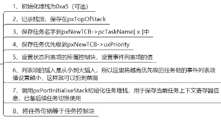

# FreeRTOS
基础知识：
抢占式，时间片式。
## 1. FreeRTOS系统配置文件
FreeRTOS 使用 FreeRTOSConfig.h 配置文件进行定制，对FreeRTOS:进行功能配置和裁剪，以及API函数的使能
详细文件内容请看官网文档：https://www.freertos.org/zh-cn-cmn-s/a00110.html
内部的宏定义大致分为三大类:
1. INCLUDE:配置FreeRTOS中可选的API函数
2. config:完成FreeRTOS的功能配置和裁剪
3. 其他配置项:PendSV宏定义、SVC宏定义
## 2. 任务创建和删除
### 2.1 API介绍
```c
//动态创建任务
BaseType_t xTaskCreate(	             
    TaskFunction_t pxTaskCode,   //指向任务函数的指针
	const char * const pcName,   //任务名，最大长度configMAX_TASK_NAME_LEN
	const uint16_t usStackDepth, //任务堆栈大小，以字为单位
	void * const pvParameters,   //传递给任务函数的参数
	UBaseType_t uxPriority,      //任务优先级，范围0~configMAX_PRIORIIES-1
	TaskHandle_t * const pxCreatedTask ) /*任务句柄，就是任务的任务控制块 */

//任务控制块结构体成员
typedef struct tskTaskControlBlock
{
	volatile StackType_t *pxTopOfStack;	/*< 栈顶：指向放置在任务堆栈上的最后一项的位置。 这必须是 TCB 结构的第一个成员 */

	ListItem_t xStateListItem; /* 任务状态列表项 */
	ListItem_t xEventListItem; /* 任务事件列表项 */
	UBaseType_t uxPriority; /* 任务优先级 */
	StackType_t *pxStack; /* 任务栈起始地址 */
	char pcTaskName[ configMAX_TASK_NAME_LEN ];//任务名
    ...省略很多条件编译的成员
}

//静态创建任务
TaskHandle_t xTaskCreateStatic（
    TaskFunction_t pxTaskCode,/*指向任务函数的指针*/
    const char * const pcName,/*任务函数名*/
    const uint32_t ulStackDepth,/*任务堆栈大小注意字为单位*/
    void const pvParameters,/*传递的任务函数参数*/
    UBaseType_t uxPriority,/*任务优先级*/
    StackType_t const puxStackBuffer,/*任务堆栈，一般为数组，由用户分配*/
    StaticTask_t const pxTaskBuffer /*任务控制块指针，由用户分配*/
）
```
* 任务堆栈设置大小要适宜。API中有一个获取指定任务的任务栈的历史剩余最小值的函数
```c
uxTaskGetStackHighWaterMark(){}
```
* 创建开始任务后有个进入临界区函数，进入临界区就是关闭了中断，等所有任务创建好后就可以退出临界区执行任务了。
## 2.2 动态创建流程
1. 
2. 
3. 
4. prvInitialiseNewTask初始化任务控制模块中的成员

    
    * 栈从上到下的地址是由高到低的。堆是由低到高的。
    * 栈动态申请出来单独使用，堆是共用的，不需要申请
    * 任务列表从上到下是由低到高的，而优先级顺序应该是由高到低的。所以把任务按照优先级放入任务列表的时候应该按照列表的规则把大的优先级数字转换为小的列表位置数字。`configMAX_PRIORITIES - (TickType_t) uxPriority` 比如：最大值32的情况下，优先级3变为32-3=29，优先级2变为32-2=30。再把这两个任务放入列表，既符合列表规则又符合优先级顺序
    * 设置栈的时候发现的新知识：xPSR, PC, LR, R12以及R3-R0由硬件自动出栈。手动出栈R4-R11的值到寄存器。
    * `*pxCreatedTask = (TaskHandle_t) pxNewTCB;`将新任务段赋值给任务句柄，所以句柄可以直接索引到任务。