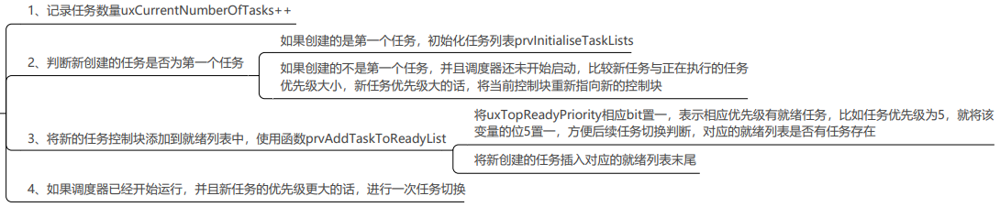
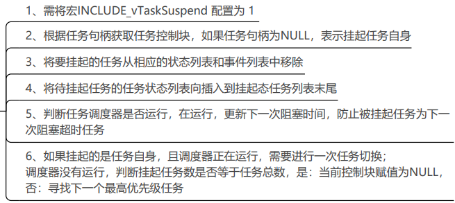
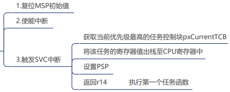
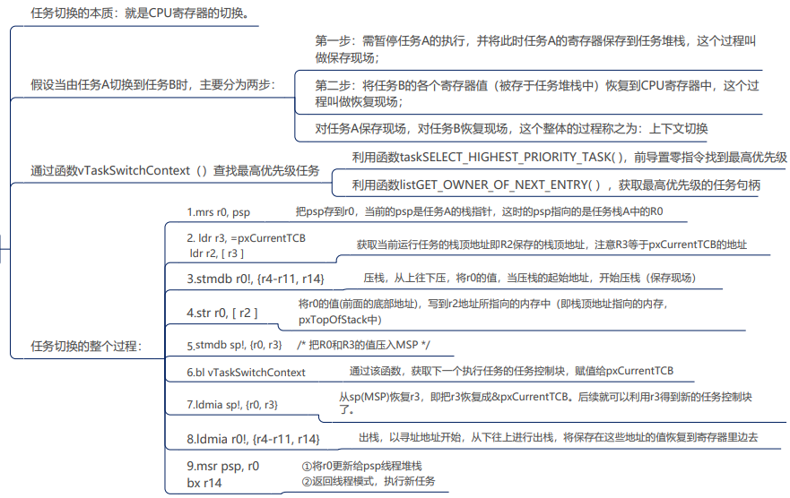
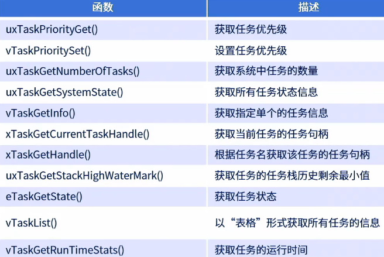
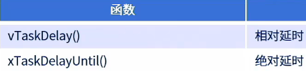

# FreeRTOS
基础知识：
抢占式，时间片式。
## 1. FreeRTOS系统配置文件
FreeRTOS 使用 FreeRTOSConfig.h 配置文件进行定制，对FreeRTOS:进行功能配置和裁剪，以及API函数的使能
详细文件内容请看官网文档：https://www.freertos.org/zh-cn-cmn-s/a00110.html
内部的宏定义大致分为三大类:
1. INCLUDE:配置FreeRTOS中可选的API函数
2. config:完成FreeRTOS的功能配置和裁剪
3. 其他配置项:PendSV宏定义、SVC宏定义
## 2. 任务创建和删除
动态和静态任务创建，区别在于静态任务创建是需要安排分配的内存的地址的，一般用的不多，平常使用<strong>一般采用动态任务创建</strong>。
### 2.1 API介绍
```c
//动态创建任务
BaseType_t xTaskCreate(	             
    TaskFunction_t pxTaskCode,   //指向任务函数的指针
	const char * const pcName,   //任务名，最大长度configMAX_TASK_NAME_LEN
	const uint16_t usStackDepth, //任务堆栈大小，以字为单位
	void * const pvParameters,   //传递给任务函数的参数
	UBaseType_t uxPriority,      //任务优先级，范围0~configMAX_PRIORIIES-1
	TaskHandle_t * const pxCreatedTask ) /*任务句柄，就是任务的任务控制块 */

//任务控制块结构体成员
typedef struct tskTaskControlBlock
{
	volatile StackType_t *pxTopOfStack;	/*< 栈顶：指向放置在任务堆栈上的最后一项的位置。 这必须是 TCB 结构的第一个成员 */

	ListItem_t xStateListItem; /* 任务状态列表项 */
	ListItem_t xEventListItem; /* 任务事件列表项 */
	UBaseType_t uxPriority; /* 任务优先级 */
	StackType_t *pxStack; /* 任务栈起始地址 */
	char pcTaskName[ configMAX_TASK_NAME_LEN ];//任务名
    ...省略很多条件编译的成员
}

//静态创建任务
TaskHandle_t xTaskCreateStatic（
    TaskFunction_t pxTaskCode,/*指向任务函数的指针*/
    const char * const pcName,/*任务函数名*/
    const uint32_t ulStackDepth,/*任务堆栈大小注意字为单位*/
    void const pvParameters,/*传递的任务函数参数*/
    UBaseType_t uxPriority,/*任务优先级*/
    StackType_t const puxStackBuffer,/*任务堆栈，一般为数组，由用户分配*/
    StaticTask_t const pxTaskBuffer /*任务控制块指针，由用户分配*/
）
```
* 任务堆栈设置大小要适宜。API中有一个获取指定任务的任务栈的历史剩余最小值的函数
```c
uxTaskGetStackHighWaterMark(){}
```
* 创建开始任务后有个进入临界区函数，进入临界区就是关闭了中断，等所有任务创建好后就可以退出临界区执行任务了。

### 2.2 动态创建流程
1. 申请堆栈内存，返回首地址
2. 申请任务控制块内存，返回首地址
3. 把前面申请的堆栈地址，赋值给控制块的堆栈成员
4. prvInitialiseNewTask初始化任务控制模块中的成员

    
    * 栈从上到下的地址是由高到低的。堆是由低到高的。
    * 栈动态申请出来单独使用，堆是共用的，不需要申请
    * 任务列表从上到下是由低到高的，而优先级顺序应该是由高到低的。所以把任务按照优先级放入任务列表的时候应该按照列表的规则把大的优先级数字转换为小的列表位置数字。`configMAX_PRIORITIES - (TickType_t) uxPriority` 比如：最大值32的情况下，优先级3变为32-3=29，优先级2变为32-2=30。再把这两个任务放入列表，既符合列表规则又符合优先级顺序
    * 设置栈的时候发现的新知识：xPSR, PC, LR, R12以及R3-R0由硬件自动出栈。手动出栈R4-R11的值到寄存器。
    * `*pxCreatedTask = (TaskHandle_t) pxNewTCB;`将新任务段赋值给任务句柄，所以句柄可以直接索引到任务。
5. 调用prvAddNewTaskToReadyList 添加新创建任务到就绪列表中：


## 3 任务挂起和恢复
1. 中断服务程序中要调用freeRTOS的API函数则中断优先级不能高于FreeRTOS所管理的优先级。（FreeRTOS管理5-15，中断若在0-4则不能使用这个API，NVIC中数字越小优先级越高。）
2. 为了方便FreeRTOS管理，<strong>建议将所有优先级位都指定为抢占优先级位，不留下任何子优先级位。</strong>在启动RTOS之前，调用`NVIC_PriorityGroupConfig(NVIC_PriorizyGroup_4)`确保所有优先级位分配为抢占优先级。
3. 任务挂起函数:

* 注：列表内任务全部挂起之后进入空闲任务状态，空闲任务不能被挂起！！（阻塞任务也不能挂起）

## 4 中断管理
ARM Cortex-M使用了&位宽的寄存器来配置中断的优先等级，这个寄存器就是中断优先级配置寄存器（可控制2^8=256个中断）。但STM32只用了高4位（可控制16个中断）。
* STM32中断优先级分为抢占优先级和子优先级。子优先级：当同时发生具有相同抢占优先级的两个中断时，任优先级数值小的优先执行。`NVIC_PriorizyGroup_4`代表4bit全都是抢占优先级，0bit给子优先级。
* <strong>中断优先级越小越优先，任务优先级越打越优先</strong>
* 三个系统中断优先级配置寄存器SHPR123 在M4权威指南P286页，其中最重要的是SHPR3里面的SysTick和PendSV的优先级
* 将SysTick和PendSV的优先级设置为最低。即<strong>中断可以打断任务，但任务不可以打断中断</strong>。
* 三个中断屏蔽寄存器，PRIMASK、FAULTMASK和BASEPRI。FreeRTOS使用BASEPRI管理中断。这个寄存器最多有9位（由表达优先级的位数决定）。它定义了被屏蔽优先级的阈值。当它被设成某个值后，所有优先级号天于等于此值的中断都被关（优先级号越大，优先级越低）。但若被设成0，则不关闭任何中断，0也是缺省值。
注：FreeRTOS关闭的只是自己管理的5-15优先级内的中断
* vTaskDelay()调用会进入临界区，最后会把中断寄存器写入0值，导致开启中断。<strong>可能影响前面刚刚关闭中断的操作</strong>。

## 5 临界段代码保护、调度器挂起与恢复
### 5.1 临界段代码保护
临界段代码又叫临界区，是指那些必须完整运行，不能被打断的代码段。关中断+PendSV设置最低优先级关任务调度。
```c
//任务级
taskENTER_CRITICAL();
{
    /*临界区*/
}
taskEXIT_CRITICAL()

//中断级
uint32 t save_status;
save_status taskENTER_CRITICAL_FROM_ISR();
{
    /*临界区*/
}
taskEXIT_CRITICAL_FROM_ISR(save_status)
```
### 5.2 调度器挂起与恢复
仅仅挂起任务调度器，此时不关闭中断。<strong>适用于临界区位于任务与任务之间，既不用延时中断，又能保护临界区</strong>。
实现方法去代码里查看`uxSchedulerSuspended`与`pdFlase`的微妙关系
```c
VTaskSuspendAll();
{
    /*内容*/
}
XTaskResumeAll()
```
## 6 列表和列表项
感觉就是链表。详细内容参考数据结构
* 列表结构中`MiniListItem_t xListEnd`迷你列表项，总是在列表的末尾。仅用于标记列表的末尾和挂载其他插入列表中的列表项。它不参与uxNumberOfItems列表项个数的计算。
```c
struct xLIST_ITEM
{
    listFIRST_LIST_ITEM_INTEGRITY_CHECK_VALUE /*用于检测列表项的数据完整性*/
    configLIST_VOLATILE TickType_t xltemValue /*列表项的值*/
    struct XLIST_ITEM * configLIST_VOLATILE pxNext /*下一个列表项*/
    struct XLIST_ITEM * configLIST_VOLATILE pxPrevious /*上一个列表项*/
    void * pvOwner /*列表项的拥有者*/
    struct XLIST * configLIST VOLATILE pxContainer; /*列表项所在列表*/
    listSECOND_LIST_ITEM_INTEGRITY_CHECK_VALUE /*用于检测列表项的数据完整性*/
}；
typedef struct xLIST_ITEM Listltem_t;
```
* 列表项按照`xItemValue`的值升序排列
* `pvOwner`保存列表项的对象，通常就是任务控制块
* `pxContainer`指向列表项所在的列表

## 7 任务调度、任务切换
### 7.1 任务调度
`vTaskStartScheduler()`开启任务调度器，它的内部实现：
1. 创建空闲任务
2. 如果使能软件定时器，则创建定时器任务(默认使能了)
3. 关闭中断，防止调度器开启之前或过程中受中断干扰，会在运行第一个任务时打开中断
4. 初始化全局变量，并将任务调度器的运行标志设置为已运行
5. 初始化任务运行时间统计功能的时基定时器
6. 调用函数`xPortStartScheduler()`

`xPortStartScheduler()`用于完成启动任务调度器中与硬件架构相关的配置部分，以及启动第一个任务，内部实现：
1. 检测用户在FreeRTOSConfig.h文件中对中断的相关配置是否有误
2. 配置PendSV和SysTick的中断优先级为最低优先级
3. 调用函数vPortSetupTimerlnterrupt()配置SysTick
4. 初始化临界区嵌套计数器为0
5. 调用函数prvEnableVFP()使能FPU，(查看M4第13章FPU部分)
6. 调用函数prvStartFirstTask()启动第一个任务

`prvStartFirstTask()`启动第一个任务
<br>
启动第一个是任务A，那么需要将A的寄存器值恢复到CPU寄存器里面。创建A时把A的寄存器值保存在任务A的堆栈里面了。注意：(查看M4第三章)
1. 中断产生时，硬件自动将xPSR,PC(R15),LR(R14),R12,R3-R0保存和恢复；而R4~R11需要手动保存和恢复
2. 进入中断后硬件会强制使用MSP指针，此时LR(R14)的值将会被自动被更新为特殊的EXC_RETURN值

初始化启动第一个任务前要重置MSP指针，什么是MSP指针？
* 程序在运行过程中需要一定的栈空间来保存局部变量等一些信息。当有信息保存到栈中时，MCU会自动更新SP指针，ARM Cortex-M内核提供了两个栈空间：
    1. 主堆栈指针(MSP)：它由OS内核、异常服务例程以及所有需要特权访问的应用程序代码来使用。
    2. 进程堆栈指针(PSP)：用于常规的应用程序代码（不处于异常服务例程中时）。

在FreeRTOS中，中断使用MSP（主堆栈），中断以外使用PSP（进程堆栈）。裸机开发全都使用MSP。<br>
注：M4规定，汇编的时候要手动8字节对齐，C语言会自动对齐。
### 7.2 任务切换
任务切换的过程在PendSV中断服务函数里边完成。<br>
PendSV（可挂起的系统调用）异常对OS操作非常重要，其优先级可以通过编程设置。可以通过将中断控制和壮态寄存器ICSR的bit28,也就是PendSV的挂起位置1来触发PendSV中断。与SVC异常不同，它是不精确的，因此它的挂起壮态可在更高优先级异常处理内设置，且会在高优先级处理完成后执行。<br>
利用该特性，若将PendSV设置为最低的异常优先级，可以让PendSV异常处理在所有其他中断处理完成后执行，这对于上下文切换非常有用，也是各种OS设计中的关键。
<br>
FreeRTOS触发PendSV的两种情形：滴答定时器中断调用；相关API：`porYIELD()`。


## 8 时间片调度、一些相关API函数、延时函数
* 一个时间片 == SysTick中断周期
* 注：使用时间片调度需把宏configUSE_TIME_SLICING和configUSE_PREEMPTION置1
* dekay_ms()是自己实现的，不进入阻塞态。抢占式调度慎用
* <strong>下图这些API函数用于调试阶段，正式运行要删除</strong>


* <strong>使用这些函数的时候，注意将相关宏置1</strong>
* 历史剩余最小堆栈为0，有可能已经溢出了，只是不会显示剩余负数而已
* 时基定时器精度需高于系统节拍精度的10~100倍。时基越快统计的越准确，详情查看[运行时间统计](www.freertos.org/rtos-run-time-stats.html)

<br>
相对延时：指每次延时都是从执行函数`VTaskDelay()`开始，直到延时指定的时间结束<br>
绝对延时：指将整个任务的运行周期看成一个整体，适用于需要按照一定频率运行的任务<br>
* 绝对延时的计算：任务运行+延时+.. = 给定的绝对延时时间

注：详情请看：FreeRTOS开发指南第十二章

## 9 消息队列（未仔细看）
队列可以在任务与任务、任务与中断之间传递消息，队列中可以存储有限的、大小固定的数据项目。任务与任务、任务与中断之间要交流的数据保存在队列中，叫做队列项目。
* 队列采用实际值传递，将数据拷贝到队列中进行传递。也可以传递指针，在传递较大的数据时采用指针传递
* 保护变量数据传递
* 信号量都是用队列实现的
* 队列不属于某个任务，任何任务和中断都可以向队列发送读取消急
* 当队列已满无法入队，可以指定一个阻塞时间，
    1. 若阻塞时间为0 :直接返回不会等待；
    2. 若阻塞时间为0~port MAX DELAY ：等待设定的阻塞时间，若在该时间内还无法入队，超时后直接返回不再等待；
    3. 若阻塞时间为port_MAX_DELAY :死等，一直等到可以入队为止。出队阻塞与入队阻塞类似；
* 多个任务等待同一个队列空间：优先级最高的先出入操作。<strong>优先级相同时，等待时间最久的任务先出入操作</strong>
* 动态静态方式创建队列，一般用动态的
* 队首写入，队尾写入，覆写。仅有队列长度为1时，使用覆写
* 读消息有两种：从头部读完删除和读完不删除
* 队列的写入方式不太一样，比如尾部写入，<strong>是从尾部向头部一个个写入。而不是从尾部开始向后继续追加！！！</strong>写满队列时，指针返回开始写的地方（头部写入返回头部，尾部写入返回尾部）

## 10 信号量