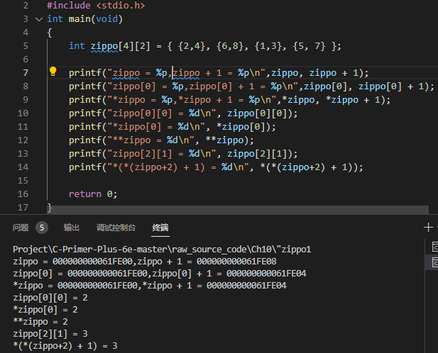

### 1 指针和多维数组要点

编译器看到的数组只是一段地址而已，所以*(arr+2)实际是指向了{1，3}中的1的地址，而我们看到的是*(arr+2)是{1,3}
总结：
C设计变量时，变量名<==>变量值(内容)。一贯性原则设计数组
 

### 2 传递结构指针
使用指针方式 ————> 传递地址。
```C
#include<stdio.h>
#include<string.h>

#define NLEN 30
struct namect{
	char fname[NLEN];
	char lname[NLEN];
	int letters;
};
void getinfo(struct namect *);
void makeinfo(struct namect *);
void showinfo(const struct namect *);
char s_gets(char *st,int n);

int main(void)
{
	struct namect person;

	getinfo(&persion);
	makeinfo(&person);
	showinfo(&person);
	return 0;
}
void getinfo(struct namect *pst)
{
	printf("please enter your first name.\n");
	s_gets(pst->fname,NLEN);
	printf("please enter your last name.\n");
	s_gets(pst->lname,NLEN);
}

void makeinfo(struct namect *pst)
{
	pst->letters = strlen(pst->fname) + strlen(pst->lname);
}

void showinfo(const struct namect *pst)
{
	printf("%s %s , your name contains %d letters.\n",
			pst->fname,pst->lname,pst->letters);
}

char s_gets(char *st,int n)
{
	char *ret_val;
	char *find;

	ret_val = fgets(st,n,stdin);
	if(ret_val)
	{
		find = strchr(st,'\n');//查找换行符
		if(find) // 如果地址不是NULL
			*find = '\0'; // 放置一个空字符
		else
			while(getchar() !='\n')
			 continue; // 处理输入行的剩余字符
	}
	return ret_val;
}
```
### 3 C预处理
#### # 用宏参数创建字符串
#### ## 预处理器粘合剂
#### ...和__VA_ARGS__ 变参宏 
通过把宏参数列表中最后的参数写成省略号（即3个点...）来实现这一功能。预定义宏__VA_ARGS__可用于替换部分中，表明省略号代表什么。`#define PR(...) printf(__VA_ARGS__)`<br>
C99/C11对宏提供让用户自定义带可变参数的函数。由 stdvar.h 头文件提供。
⚠️记住：省略号只能代替最后的宏参数。
### 4宏和函数的选择
#### 4.1 如何选择？
使用宏比普通函数更复杂一些，稍有不慎会有副作用。（一些编译器规定宏只能定义成一行）
需要注意时间和空间的制衡。
* 宏生成内联代码，在程序中生成语句。函数调用无论多少次，程序中只有一份函数语句的副本，节省了空间。
* 程序的控制必须跳转到函数内，随后再返回主调函数，这比内联代码花费更多时间。
对于简单的函数，程序员通常使用宏
#### 4.2 宏的注意点
* 宏名不允许有空格，但替换字符中可以有空格。
* 圆括号把宏的参数和整个替换体括起来，能确保被括起来的部分在表达式正确展开。
* `大写字母表示宏函数的名称`（大写字母可以提醒程序员可能产生副作用）。例如：`MAX(X,Y)`
* 如果打算使用宏加快程序运行速度，首先要确定使用宏和使用参数是否会导致较大的差异。

`在程序中使用一次的宏无法明显减少程序的运行时间，在嵌套循环中使用宏更有助于提高效率。`

### 5 预编译杂项指令
* 用 `#ifndef` 和 `#define` 防止多重包含头文件
* 5.2 `#undef`指令 取消 已定义的`#define`定义。
* 5.3 条件编译 `#ifdef、#else 和 #endif`

### 6. `内联函数（C99）`和 `_Noreturn`函数（C11）

#### 6.1 内联函数
函数调用会有一定的开销，原因：函数的调用过程包括`建立调用、传递参数、跳转到函数代码并返回`。
>解决办法
>
> 1. 使用宏使代码内联，可避免开销。
> 2. C99中方法：内联函数。

内部链接的函数可以成为内联函数。
> 内联函数的定义与调用该函数的代码必须在同一个文件中。

创建内联函数的方法：使用函数说明符`inline` 和存储类别说明符`static`。

~~内联函数无法在调试器中显示~~

如果是多个文件使用某个内联函数，则将内联函数定义放在头文件中，并在使用的文件中引入头文件即可。
>一般情况下，~~不在头文件中放置可执行代码~~，内联函数特例。


#### 6.2 `_Noreturn`函数

C11中新增函数说明符`_Noreturn` ，表明调用后函数不返回主调函数。

`exit()` 函数是 `_Noreturn` 函数的特例。~~`exit()` 不会返回主调函数~~。

⚠️注意：与`void类型`不同，`void函数`的类型在执行完毕后返回主调函数，但它`不提供返回值`。
### 7. C库

#### 7.1 访问C库
- 自动访问
    
    在使用函数之前必须先声明函数的类型，通过包含合适的头文件即可。

- 文件包含

    通过#include来引入。

- 库包含

    通过编译时选项显式指定某些库。
> 与包含头文件不同，头文件提供函数声明或原型。
>
> 库选项告知系统到哪里查找函数代码。

#### 7.2 数学库


#### 7.3 通用工具库
通用工具库包含各种函数，包括随机数生成器、查找和排序函数、转换函数和内存管理函数。
> 这些函数均在 stdlib.h 头文件中

- `exit()` 和 `atexit()` 函数
`main()函数`返回系统时将自动调用 `exit()` 函数。

**`atexit()` 函数的用法**
使用`atexit()` 函数，只需把退出时要调用的`函数地址`传递给`atexit()` 即可。

**`exit()` 函数的用法**

`exit()` 执行完 `atexit()` 指定的函数后，会完成一些清理工作：*刷新所有输出流、关闭所有打开的流和关闭由标准`I/O函数 tmpfile()` 创建的临时文件*。

- `qsort()` 函数

快速排序算法（`qsort()函数`）：排序数组的数据对象。原型如下：
```cpp
void qsort(void *base,size_t nmemb,size_t size,
            int (*compare)(const void *,const void *));
```
> 第1个参数：值指向待排序数组首元素的指针。可引用任何类型的数组。
>
> 第2个参数：待排序项的数量。
>
> 第3个参数：数组中每个元素占用的空间大小。
>
> 第4个参数：一个指向函数的指针（返回int类型的值且接受两个指向const void 的指针作为参数）。

#### 7.4 断言库
`assert.h 头文件` 支持的断言库：用于`辅助调试程序`的小型库。由 `assert()宏`组成，接受一个整型表达式作为参数。

`assert()` 的参数是一个`条件表达式` 或 `逻辑表达式`。
> 如果`assert()`中止程序，则首先会显示失败的测试、包含`测试的文件名和行号`。


C11 中新增 `_Static_assert()` ：
- 第1个参数：整型常量表达式
- 第2个参数：一个字符串

与assert() 的区别
- `assert()` 会导致 *正在运行的程序中止*。
- `_Static_assert()` 可导致 *程序无法编译通过*。