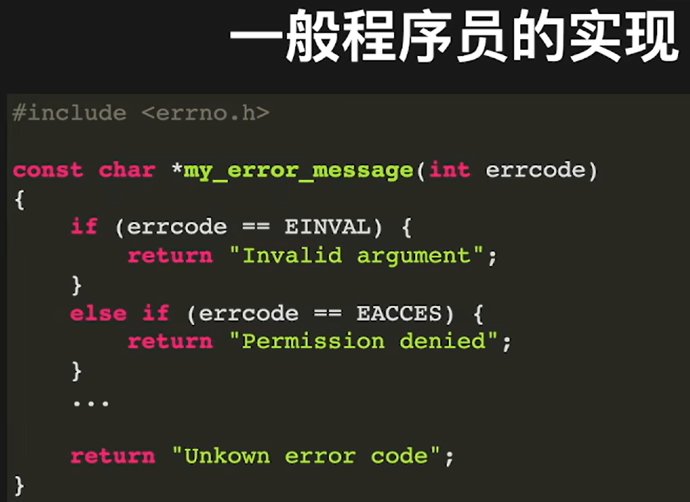
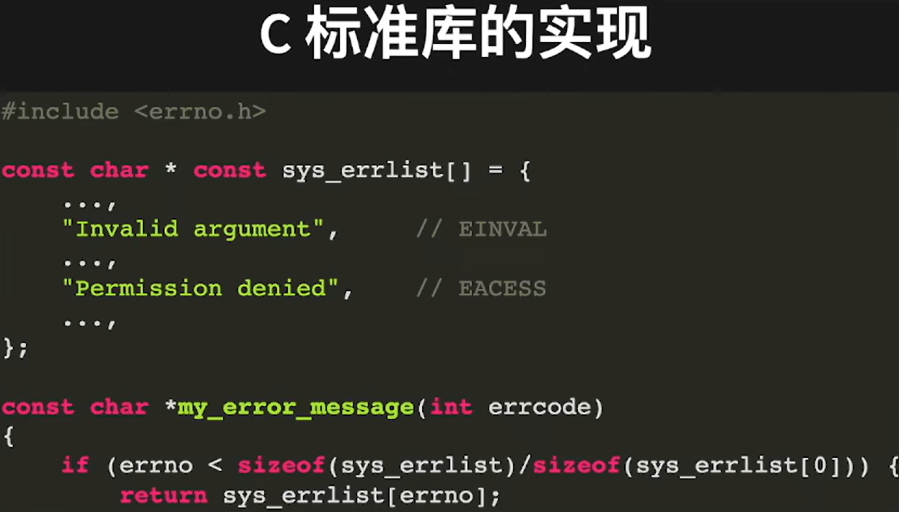
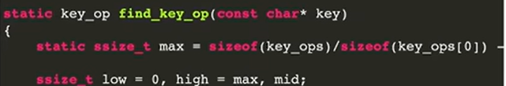
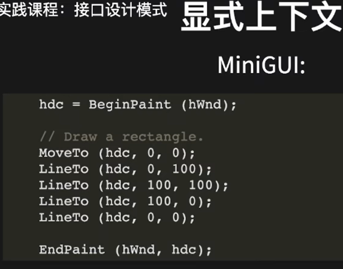
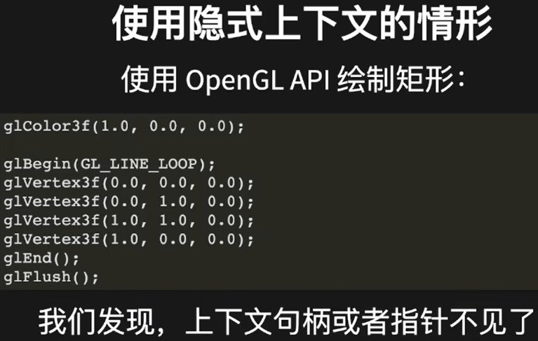
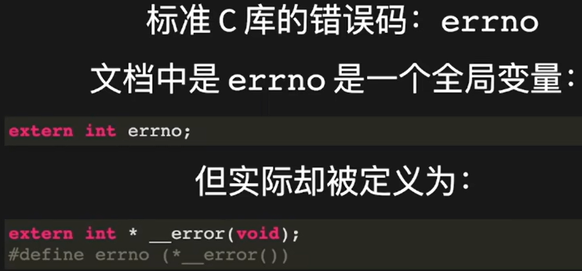
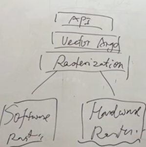

# 1 将数据从代码中分离


## 1.1 分离代码和数据的优劣:
* 优:
    1. 分开维护数据和代码
    2. 增加新的数据时，不需要修改核心功能代码
    3. 简化代码结构
    4. 提高执行效率
* 劣：不直观，可读性下降
# 2 好代码是多次重构出来的
## 2.1 小优化技巧：静态变量在C中相当于全局变量
这种用法让该语句只执行一次，不用每次进入该函数再算一次
但注意：该应用场景是处理静态表，动态表只能每次都算 

# 3 显式上下文和隐式上下文
## 3.1 对比
可以后续不停的扩充上下文的参数，达到扩展接口的目的


隐式上下文在接口中无需再传指针，但实际是有这个指针的。
隐式上下文的好处：
* 减少函数中的参数传递，尤其是上下文和线程绑定时。
* 解决接口的历史遗留问题。

## 3.2 一个隐式上下文例子：

`*__error()`实际对应的线程本地存储(TLS)会去取这个指针。宏定义为`errno (* __error())`,这时errno既可以放在等号左边赋值也可以放在等号右边取值。

# 4 事件驱动接口的基本概念
1. 事件生产者
2. 事件消费者 
3. 事件处理器（回调函数）

## 4.1提高抽象能力
* 对事物的正确认识建立在归纳总结之上
* 抽象是归纳总结的一种升华

## 4.2 一个提高的方法：学好高等数学，比如：群论（高等线性代数），集合的可数性

# 5 子驱动程序模式
## 5.1 子驱动程序模式在稍有规模的C项目中大量应用

1. Unix的万物皆文件
2. Unix/Linux内核的虚拟文件系统以及设备驱动程序
3. MiniGUI中支持多种类型的图片格式以及逻辑字体

## 5.2 子驱动程序模式的一般实现套路
1. 一套聚类接口
2. 一些公共数据组成的抽象对象（数据结构）
3. 一组函数指针组成的操作集（数据结构）
4. 针对不同子类的操作集实现

## 5.3 例子
STDIO接口的实现：
```C
struct _file_obj;
typedef struct _file_obj file_obj;
struct _file_ops {
    file obj *open(void *pathname buf,size t size,const char
    ssize_t read(file_obj *file,void *buf,size t count);
    ssize_t write(file_obj *file,const void *buf,size t count
    off_t lseek(file obj *file,off t offset,int whence);
    void close(file_obj *file);
};
struct _FILE;
typedef struct _FILE FILE;
```
文件对象操作里面实现了5个指针方法基本就够了。
_FILE对象只要被外界调用就行，不需要暴露内容出去，如果要简单实现的话，参考下面的代码（忽略了缓冲区等功能）。
```c
struct _FILE{
	struct file ops* ops;
	struct file_obj* obj;
};
```
然后在实现功能的时候这样使用即可：
```C
FILE *fopen(const char *pathname, const char *mode)
{
	FILE *file = NULL;
	file_obj *obj=file_open(pathname,0,mode);
    //生成底层obj对象指针
	if (obj){
		file = calloc(1,sizeof(FILE));
		file.obj = obj;
        //把底层obj传递给file指针
		file.ops = file file ops;
	}
	return file;
    //到这里，外部就可以使用了
}
```
## 5.4 进一步思考与解决
1. STDIO是带有缓冲区功能的，缓冲区信息应该在FILE中维护还是在file obj中维护？
2. 当前读写位置在什么地方维护？
3. 子驱动程序设计的关键点
	1. 抽象对象的数据结构如何确定？
	2. 操作集如何取舍？
### 5.4.1 正确区分机制和策略
* 机制：需要提供什么功能
    1. 比如文件就只是存储读取。至于文件保存的是什么样的数据不是文件需要关心的，交给别人去做。
    2. 又比如内核层，文件内容对内核层也没意义，内核层只要管把文件存放在正确的位置，在需要时正确的返回该位置就够了。
* 策略：如何使用这些功能
* 以STDIO实现为例
    1. 缓冲区是个功能，带有缓冲区支持的格式化输入输出属于使用策
略，对不同类型的文件对象是一样的。
    2. 子驱动程序，文件操作集提供的就是机制，符合最小的完备
集合原则。它不需要策略，只需要完成机制。

可加载模块是子驱动程序模式的一种自然模块，是模块间的解耦神器


可加载模块的重要设计原则
1. 认清模块在软件栈中的位置
2. 向下依赖，不要向上依赖
3. 避免同级依赖

# 6 状态机
## 6.1 状态机的概念
1. 一个硬件或者一个软件模块；
2. 我们给状态机一个初始状态；
3. 然后给状态机一个事件；
4. 状态机根据事件和当前状态完成一个动作或者转
换到另外一个状态；
5. 终止执行或者等待下一个事件。

如此，状态机就成了一个可重复工作的机器
## 6.2 状态机理论
1. 术语
    * 状态(State)：可分为当前状态（现态）和迁移后的新状态（次态）
    * 事件(Event):又称为条件
    * 动作(Action)
    * 迁移、转换或变换(Transition)
2. 分类
    * Moore状态机：次态无关事件。
    * Mealy状态机：次态和现态及事件均有关。
## 6.3 确定性状态机
1. 使用状态迁移图/表理清迁移关系。
2. 状态数量较少时，一个包含上下文信息的函数搞定，内部使用条件分支代码
3. 状态数量较多时，为每个状态定义回调函数，在回调函数中实现对这个状态的处理
### 6.3.1 用状态机实现C语言立即数的判断机制
注：另一种方法：每个状态都有一个回调函数，切换状态就是切换回调函数的地址。 
1. 前缀0x表示十六进制、前缀0表示八进制，其他表示十进制
2. 状态：未知、零前缀、八进制、十六进制、十进制、错误
```c
//定义状态
enum {
    SSM_UNKNOWN = 0,
    SSM_PREFIX_ZERO,
    SSM_RESULT_FIRST，
    SSM_OCT_SSM_RESULT_FIRST,
    SSM_HEX,
    SSM_DEC,
    SSM_ERR,
};
//定义进制判断状态机
struct _scale_state_machine {
    int state;//当前状态
}:
//定义初始化
static int init_scale_state_machine(struct scale_state_machine *sm,...){
    sm->state = SSM_UNKNOWN;
}

static int check_scale(struct scale_state_machine *sm,char ..)
{
    switch(sm->state){
    case SSM_UNKNOWN:
        if(ch == '0')
            sm->state = SSM_PREFIX_ZERO;
        e1se if(ch >= '1' && ch <= '9')
            sm->state = SSM_DEC;
        else
            sm->state = SSM_ERR;
        break;
    case SSM_PREFIX_ZERO:
        if (ch =='x' || ch =='X')
            sm->state SSM_HEX;
        else if (ch >='0' || ch <'7')
            sm->state = SSM_OCT;
        else
            sm->state = SSM_ERR;
        break;
    }
    return sm->state;
}

int check_scale(const char *literal)
{
    //初始化一个状态机
    struct _scale_state_machine sm;
    init_scale_state_machine(&sm);
    //循环
    while (*literal){
        int scale = ？？(&sm,*literal);
        //超出所有状态，结束
        if (scale >SSM_RESULT_FIRST)
            return scale;
        //正常循环下一个字符
        literal++;
    }
    return SSM_ERR;
}
```
## 6.4 自定义状态机
1. 事件是确定的、有限的。
2. 状态是一种抽象对象而不是一个简单的枚举变量；状态被组织为链表或者树形数据结构。（这样的结构其实可以无限添加状态）
3. 每个状态可根据输入的事件构造一个抽象的迁移对象。
4. 迁移对象实现动作及状态迁移；通常，状态迁移发生在相邻的状态节点之间。
5. 状态机构造状态数据结构，并根据状态返回的迁移函数运行，直到停止
### 6.4.1 应用场景
1. 轨迹生成器
    * 状态是代表不同轨迹的时间曲线方程（如线性、贝塞尔曲线等）
    * 事件是定时器。
    
2. 动画控制器
    * 状态是不同的动画效果（如放大、缩小、淡入、淡出、渐变）
    * 事件是定时器或者用户输入。
# 7 为高性能编码
1. 性能包含两层含义：
    * 空间复杂度
    * 时间复杂度
2. 优化性能：空间复杂度和时间复杂度的平衡。
## 7.1 提高性能的两个基本原则
### 7.1.1 不做无用功


常见的无用功:
1. 没必要的初始化
2. 多余的函数调用
```c
void foo(void){
    //初始化后无意义的赋值
    char buf[64] = {};
    //多余的显式调用memset
    memset(buf,0,sizeof(buf));
    //目的是将"foo"拷贝到buf，那么前面只需要char buf[64];就够了
    strcpy(buf,"foo");
    ...
}
```
### 7.1.2 杀鸡莫用牛刀
1. 滥用STDI0接口
```c
sprintf(a buffer,"ss&s",a_string,another_string);
//使用sscanf把字符串转10进制再使用。
sscanf(a_string,"sd",&i);
//STDIO的开销很大，他实际上是将字符串转成一个拥有缓冲区的抽象对象，然后再做格式化输出
```
2. 滥用高级数据结构
例如：传了个字符串只有两种可能，此时非要用哈希去实现，多此一举。

## 7.2 常见方法技巧
### 7.2.1 动态缓冲区分配
```c
内存调用中减少ma11oc的调用，让栈缓冲区覆盖常规情形
#include <limits.h>
//malloc要使用堆，而且开销比较大。每次都使用malloc开销巨大
void foo(size_t len)
{
    //创建一个固定大小的栈,作为栈缓冲区
    char stack_buff[PATH_MAX +1];
    char *buff;
    //只有内容超过栈缓冲区大小时，才使用malloc
    if(len > sizeof(stack_buff))
        buff = malloc(len);
    else
        buff = stack_buff;
    if (buff){
        ...
        if (buff != stack_buff)
            free(buff);
    }
}
```
### 7.2.2 字符串匹配
1. 普通：逐个匹配
2. 高级：哈希散列算法
3. 屠龙：字符串原子化
    * 原子(Atom,也叫Quark)表示一个可以唯一性
确定一个字符串常量的整数值
    * 背后的数据结构是一个AVL树或者是红黑树，保
存着字符串常量和整数之间的映射关系

原子化方法好处：
1. 原先要分配缓冲区存储指针的地方，现在只需要存储一个整数
2. 原先调用strcmp对比字符串的地方，现在可使用==直接对比
3. 原先使用复杂判断的地方，现在可以使用switch语句
4. 通用，但综合性能未必最佳(树结构可能会增加空间复杂度)

## 7.3总结
1. 线性访问、整数运算永远最快
2. 通常我们需要用空间换速度
3. 通用方案的空间代价较高，最佳方案需因地制宜，不可僵化